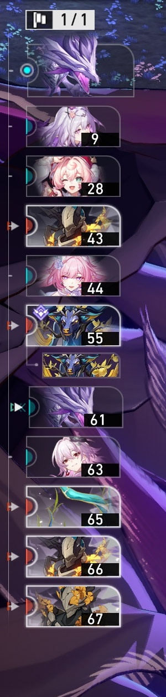
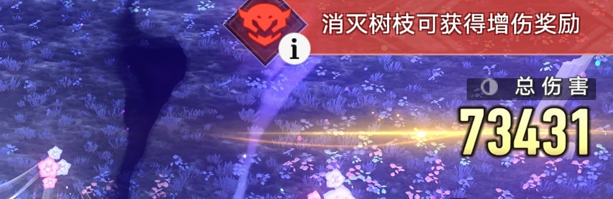

# 崩铁伤害统计 · hsr-damage-meter

**从游戏画面实时读出「总伤害」，识别这一击是谁打的，在悬浮窗里显示每个角色的伤害统计。**

不修改游戏、不读内存、不联网 —— 只用屏幕像素。全程本地推理，单帧处理 **p95 ≈ 21 ms**（预算 100 ms）。

> 面向《崩坏：星穹铁道》PC 端。开发/调参记录见 [`docs/`](docs/)（[文档索引](docs/文档索引.md)）。

---

## 它长什么样

<p align="center">
  
  &nbsp;&nbsp;
  
</p>

* **左**：行动轴 —— **顶端那张卡**就是"现在谁在行动"（图里是忆灵"死龙"，按规则算给它的召唤者**遐蝶**）。
* **右**：右上角「总伤害」 —— 每次攻击的累计值（图里 `73431`）。长攻击会逐步累积，取最终值。

程序把两者合起来：**数值 + 归属 → 每个角色的累计伤害**，画在一个置顶、鼠标穿透的悬浮窗上。

---

## 快速开始

### 方式一：直接用打包好的 exe（推荐）

1. 到 [Releases](../../releases) 下载 `HSR伤害统计_onedir.zip`，解压
2. 双击 `HSR伤害统计.exe` → 弹出控制面板 → 点 **「开始统计」**
3. 切回游戏（建议「**窗口化全屏 / 无边框**」），悬浮窗会出现在屏幕左上角
4. 退出：按 `Ctrl+Alt+Q`，或在控制面板点「停止」

> **建议进战前就点开始** —— 这样战斗一开始的伤害都会被记录。

### 方式二：从源码跑

```bash
git clone https://github.com/<你>/hsr-damage-meter.git
cd hsr-damage-meter
pip install -r requirements.txt
# 还需要 ffmpeg（见下方"环境要求"）

python mvp/live_mvp.py --countdown 15 --seconds 300 --overlay
```

先验证装好了没（不需要游戏）：

```bash
python mvp/live_mvp.py --selftest          # 资源 / 模型 / 引擎 / 悬浮窗 全套自检
python eval_holdout.py                     # 数字识别：留出集逐字 29/29、整串 5/5
```

---

## 它做什么 / 不做什么

| ✅ 做 | ❌ 不做 |
|---|---|
| 读右上角「总伤害」数字（含两种美术字） | 不读伤害飘字（按规则推算附伤） |
| 认行动轴顶端是谁在行动（含**忆灵/召唤物**） | 不读整列队列 / 行动值数字 |
| 归属到角色：**忆灵算召唤者、附伤按倍率所有者** | 不做 dot / 状态类持续伤害（**计划中的 DLC**） |
| 置顶 + 鼠标穿透的实时悬浮窗 | 不改游戏、不读内存、不联网 |
| 任意队伍适配（跑一次 onboarding 即可） | 不保证任何分辨率/UI 缩放都可用（见下） |

---

## 支持哪些角色

**共享模板库已含 109 个角色**（`out/axis_top_bank_E.npz`），换队伍**不需要改代码** ——
跑一次 onboarding 流水线，把新队伍的头像模板挖出来入库即可：

```bash
# 1) 抽帧（给一段该队伍的战斗录屏）
python axis_onboard.py extract --video "records/你的录屏.mp4" --team 我的队 --step 2 --end 360
# 2) 自动聚类成"候选头像组"
python axis_onboard.py cluster --team 我的队
# 3) 出图给用户认脸 —— 用户只需回答一次"这张是谁"
python axis_onboard.py label   --team 我的队
# 4) 建库 + 自检
python axis_onboard.py build   --team 我的队
python axis_onboard.py eval    --team 我的队
```

**为什么能这么省事**：行动轴卡面是战斗 UI **专用的一套半身立绘**，
在官方资料库里**找不到**（实测穷尽 5061 张官方 PNG，最佳匹配全是无关图标）。
所以模板只能从**录屏里挖** —— 这也正是 onboarding 要做的唯一一件事。

---

## 环境要求

* **Windows 10/11**（用了 `PrintWindow` / `SetWindowDisplayAffinity` 等 Win32 API）
* **Python 3.10+**（开发环境是 3.14）
* **ffmpeg** —— 用于从录屏抽帧（**不是** Python 包）：
  ```powershell
  winget install Gyan.FFmpeg          # 装完重开终端
  # 或把 ffmpeg.exe 的目录加进 PATH
  # 或设环境变量：setx HSR_FFMPEG "D:\tools\ffmpeg\bin\ffmpeg.exe"
  ```
* Python 包：`pip install -r requirements.txt`
  （实时链路走 ONNX，**不需要 torch**；只有重训模型/离线对账才要）

> **屏幕缩放必须声明 DPI 感知** —— 代码里已处理（`capture.enable_dpi_awareness()`）。
> 你的缩放若不是 200%，HUD 位置会由**墨迹自适应定位**处理，一般无需改配置。

---

## 已知限制（诚实清单）

1. **只在本机验证过一个分辨率**（2880×1800 / DPI 200%）。结构上没写死坐标，
   但**没在别的分辨率实测过**。
2. **定稿延迟 ≈ 2.4 秒** —— 悬浮窗上的数字比画面慢约 2.4 s 才"落定"。
   这是"与离线口径逐事件一致"的代价，**不是处理延迟**（处理 p95 只有 ~21 ms）。
3. **「合计」是下界** —— 判不出行动者的事件一律标 `待复核`、**不计入**（宁可漏，不要错）。
   所以合计 ≤ 真实总伤。
4. **附伤的"量"是估算** —— 需要游戏内面板数值才能精确；当前按倍率占比推算，界面会标「估算」。
5. **独占全屏下桌面悬浮窗可能看不见** → 建议游戏用「窗口化全屏 / 无边框」。
6. **不读行动值数字** → 悬浮窗上的「每行动值伤害」显示 `—`。
7. **数字识别不是 100%** —— 单帧会读错，靠**多帧投票**收敛；极低置信时**宁可弃权**。
8. **需要自己的录屏** —— 原始素材（数 GB）不在仓库里，所以**无法直接复现**本文的数字。
   想验证就自己录一段，跑 onboarding 建模板即可。

---

## 工作原理（简述）

```
屏幕 ──抓屏(mss/BitBlt)──► 一帧
                            │
        ┌───────────────────┴────────────────────┐
        ▼                                        ▼
  右侧「总伤害」HUD                        左侧行动轴顶端卡
  淡黄辉光掩膜 → 列分割 → CNN 分类         多模板 NCC（灰度+梯度+色度）
  → 多帧投票（位数取众数）                  → 两道闸（分数≥0.90 且分差≥0.45）
        │                                        │
        └───────────────────┬────────────────────┘
                            ▼
                  流式事件切分 + 归属
        （段内取最大值；锚点 [-1.5s,+0.5s] 因果窗口取行动者）
                            ▼
                 每角色累计 ──► 悬浮窗
```

**几个关键取舍**（都是实测逼出来的，详见 [`docs/HUD数字读取.md`](docs/HUD数字读取.md)、
[`docs/行动轴识别.md`](docs/行动轴识别.md)）：

* **不用在线大模型 / 通用 OCR** —— 前者会**凭空编数字**（实测造出过 `123456789`），
  后者把 `48076` 读成 `94087`。固定字体 + 固定位置 + 颜色可分离 → **本地分类器**才对。
* **多帧投票按「位数众数」锁位数**，不是"优先采信位数更多的读数"
  （后者曾被杂散读数带偏：`1116982` 压过正确的 `721193`）。
* **行动轴顶端槽位置固定**，不做全图滑窗（滑窗正是"昔涟↔长夜月系统性混淆"的来源）。
* **判不出来就返回 `None`**（显示「待复核」），**不用第二名的类名凑答案** ——
  过渡帧的第二名往往只差 0.01。

---

## 目录结构

```
├─ mvp/               实时链路（抓屏 → 读数 → 事件 → 悬浮窗）+ 离线对账
├─ tools/             138 个脚本，按功能分 11 类（见 tools/README.md）
├─ docs/              14 篇文档（文档索引.md 是入口）
├─ out/               模型 / 模板库 / 数据集 / 事件表（核心资产）
├─ assets/            少量参考图
└─ 根目录 .py         23 个核心模块（HUD 读取、行动轴、事件、抓屏、几何、训练）
```

常用命令：

```bash
python axis_actor.py --selftest          # 行动轴回归（18 条真值帧 + 3 档缩放）
python -u events_v4.py --anchors         # 归属锚点对账（10 一致 / 0 不一致 / 8 正确弃权）
python mvp/live_mvp.py --replay frames/glyphcache --range 200,210 --no-overlay  # 无游戏回放
python build_exe.py --mode onedir --name HSR伤害统计   # 自己打包 exe
```

---

## 常见问题

**Q：双击 exe 没反应？**
用带控制台的构建跑一次（`python build_exe.py --mode onedir`），看报错。

**Q：悬浮窗数字一直不动、全是「待复核」？**
最常见原因：**悬浮窗压住了左上角行动轴** —— 抓屏会连同自己的窗口一起拍到。
本程序已用 `SetWindowDisplayAffinity(WDA_EXCLUDEFROMCAPTURE)` 让悬浮窗**对抓屏隐身**；
若你那台机器设不上，用 `--pos` 把悬浮窗挪开（启动时也会打印警告）。

**Q：关不掉？**
按 `Ctrl+Alt+Q`；或从终端跑时按 `Ctrl+C`。

**Q：为什么合计比游戏里少？**
因为「待复核」的事件不计入（见「已知限制」第 3 条）。这是**故意的** —— 宁可漏，不要错。

**Q：能做成读飘字 / 支持 dot 伤害吗？**
在 DLC 计划里（飘字识别需要另训一套字形；dot 是多角色混伤，口径要先定）。

---

## 许可

[MIT](LICENSE) —— 随便用、改、分发。

> 本项目与米哈游 / HoYoverse 无关，未使用任何游戏文件；所有识别模型均从**玩家自己的屏幕录像**训练而来。
