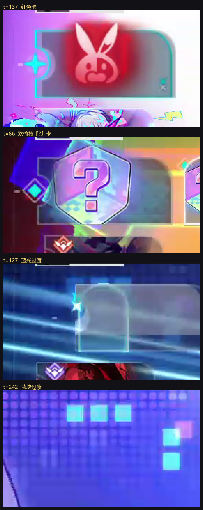

# 附伤与开大踢轴（原 T1 + T2）

> 本文合并了原来 4 篇（`附伤识别_机制详解` / `附伤机制_交付` / `附伤机制_口径与来源库` / `开大踢轴_诊断`）。
> 用户口径见 [`用户口径与铁律.md`](用户口径与铁律.md)。

**一句话**：解决两件"归属会丢"的事 ——
**① 开大（插入终结技）期间整条行动轴消失** → 借邻帧归属；
**② 一次攻击里混着别人的伤害（附伤）** → 按**倍率所有者**拆开。

---

# 第一部分：开大踢轴（T1）

## 1.1 机制

```
插入终结技 → 左上角出现本人卡 + 青色四角星（= 插入行动）
          → 全屏演出：整条行动轴从画面消失
          → 演出期间右上角「总伤害」照常跳数   ← 这就是"能读到伤害但没有行动轴"
          → 演出结束，行动轴回来
```

`card_type` 在这一段是 **`empty`**（不是 `unit`/`aha`/`elation`）
→ 所以行动轴返回低分 + `待复核` 是**正确行为，不是 bug**（两道闸设计如此）。

**真正的问题在下一层**：`find_actor` 的因果窗口只有 `[-1.5s, +0.5s]`；
演出 5~6 秒时**窗口里一个已确认帧都没有** → 整段判 `review` → **伤害不进合计**。

## 1.2 实测证据（都可复现）

| # | 角色 | 素材 | 演出窗口 | 演出期间伤害 | 紧邻的四角星卡 | 归属 |
|---|---|---|---|---|---|---|
| 1 | **飞霄** | `records/屏幕录制 2026-10-03 164043.mp4` | 379.4~385.4（6s）| 67,282 → 388,617（**+388,609**）| 飞霄 `ally_star` @377.0~379.2（**演出前**）| 飞霄 ✓ |
| 2 | **黄泉** | 同上 | 460.4~465.0（5s）| 194,580 → 1,070,137 | 黄泉 `ally_star` @465.8~467.0（**演出后**）| 黄泉 ✓（另一条路，见 §1.4）|
| 3 | **风堇** | 录屏1 `frames/glyphcache` | 214~217 | — | 小伊卡 `ally_star` @218（忆灵→召唤者）| 风堇 ✓ |
| 4 | **昔涟** | 录屏1 | 118~128（11s）| — | 昔涟 `ally_star` @129 | 昔涟 ✓（tier A）|
| 5 | **姬子·启行** | `records/屏幕录制 2026-10-04 110419.mp4`（用户专门录的）| 89~103、311~335 等 20+ 段 | 例：316.0~318.0 **+1,073,543** | 拓星者 `ally_star`（助战技插入 → 姬子·启行）| 姬子·启行 ✓ **用户已确认** |

证据图（在 `samples/`，未入库）：`T1_飞霄窗口_对照.png`、`T1_黄泉窗口_对照.png`。

## 1.3 修法：`find_actor_ult()`

```
A = 锚点之前最近的已确认帧    B = 锚点之后最近的已确认帧   （各自 ≤ ULT_MAX_AGE = 8s）

① A、B 归属相同（tier A）          → 采纳，actor_src = "ult_A"
② A 是「我方单位卡 + 四角星」       → 采纳，actor_src = "ult_S"
③ 其余                            → 不猜，保持 review
```

### 三道否决闸（都要在"借到的那一帧 → 锚点"区间上成立）

| 闸 | 判据 | 拦掉什么 | 来历 |
|---|---|---|---|
| `span_axis_gone` | 区间内存在 `marker == "empty"` 的帧 | 轴**一直在屏幕上**、只是卡面被特效糊住 → 这时锚点可能已被下一个人顶掉 | 实测飞霄窗口 (379.2,385.0) 内 15 帧 `empty` |
| `span_aha_share ≤ 30%` | 区间里 `card_type ∈ {aha, elation}` 的**占比** | 阿哈时刻/欢愉技 —— 那是**线3** 的口径，不外推 | 录屏1 #13（t=171.4~172.4）**7/11 = 64%** 是阿哈时刻；真大招窗口只有 0~8% |
| **锚点自身必须是 unit 卡** | `card_type ∈ {unit, ""}` | **两端**都是欢愉技菱形卡的跨度 —— 占比闸查不出来（它们在跨度两端，不在内部）| ⚠️ 姬子录屏 t=277 与 t=291.5 两张都是青色菱形，第一版会拿它们凑出 tier A，把 **1,511,004** 记到赛飞儿头上 |
| `ULT_MAX_AGE = 8s` | 锚点离锚点时刻的秒数 | 尾巴/长过场（实测 >8s 全错）| 与线6 `MAX_ADOPT_AGE` 一致 |

⚠️ **为什么闸用"占比"而不是"出现即否决"**：演出特效**偶尔会被误判成金环**
（实测昔涟大招窗口 t=243.4 那帧评分只有 0.42 却被判 `gold_aha`）。
按"出现即否决"会把**真大招**也拦掉。

## 1.4 ⭐ 收紧之后，黄泉为什么仍然是**对的**

黄泉走的是**另一条路**（`ult_S`：锚点前是"我方单位卡 + 四角星"），
不依赖两端一致 —— 所以收紧 tier A 不影响它。

## 1.5 验收

| 项 | 结果 |
|---|---|
| 覆盖率 | 录屏1 采纳 4 段；每个新采纳的段都**逐条看过图**（§5 记录） |
| 三条回归 | ✅ 全绿 |
| **不猜** | 每段都标了 `actor_src`，审计可追溯；拿不准的保持 `review` |

---

# 第二部分：附伤（T2）

## 2.1 ⭐ 四条判据（**用户定案**）

| # | 判据 | 出处 / 反例 |
|---|---|---|
| **1** | **归属 = 倍率所有者**（**不看**"谁在打"、**不看**"谁触发"）| 用户 2026-10-04 |
| **2** | **忆灵/召唤物**（有独立行动、顶轴有自己的卡）→ 按顶端卡归**召唤者**；**盲盒按召唤物处理** | 用户 2026-10-01「盲盒就是银狼的伤害，在计算上能看作银狼的忆灵」；2026-10-04「盲盒触发的时候顶轴是盲盒的图标，所以当作召唤物」|
| **3** | 「造成**原伤害 / 本次攻击总伤害** X%」= **独立乘区、跟当前行动者**、**不算附伤** | 覆盖：昔涟结界 `141502`、忆灵技【迷迷的声援】`1800707`、缇宝星魂 `140301`（总伤害 24% 真伤）、白厄星魂 `140806`（36%）|
| **4** | **dot 与状态类持续伤害**（含"使 dot 立即产生原伤害 %"）**本轮不处理**（多角色混伤，例：卡芙卡+海瑟音+黑天鹅同场）| 来源库里登记为 `dot_settle` / `state_dot` |

### 判据 1 的两个"反例"（**必须显式排除**，否则会误剥离）

| 反例 | 原文 | 为什么**不是**附伤 |
|---|---|---|
| 停云【赐福】`120202`/`120204` | 「获得【赐福】的目标施放攻击后，会额外造成 1 次等同于**其自身**攻击力的雷属性附加伤害」| 倍率取自**持有者自己**（通常 = 行动者）→ 归行动者。用户：「这跟停云一样，都算同袍/被赐福者的伤害」|
| 各种"自身附伤" | 虎克/希露瓦/素裳【剑势】/冻结类附加/多段弹射/多数星魂 | 倍率取自**技能主人自己**且由自己的行动触发 → 归行动者 |

### 判据 2 的"一次攻击两个归属"（**要分开计**）

| 条目 | 拆法 |
|---|---|
| 丹恒•腾荒 终结技 `141403`「【龙灵】行动时发动追加攻击」| 前半 = **丹恒** `#2`% 攻击力 → 归丹恒；后半 = **【同袍】** `#8`% 攻击力 → **归同袍** |
| 丹恒•腾荒 星魂 `141406` | 【同袍】对敌方全体造成等同于**同袍 330% 攻击力**的附加伤害 → 归同袍 |
| 昔涟忆灵技 `1141525` | 【龙灵】下 3 次攻击按**【同袍】护盾量**% 附加 → 归同袍 |
| 吉尔伽美什/Saber 连携 `150905` | 一次攻击里两人**各按自己的倍率** → 两个归属 |

**【同袍】是谁**：用户「同袍一般给了就不变，默认**伤害最高的人**」
→ 默认策略 = **累计伤害最高者**，可在 `out/t2_prefs.json` 里覆盖。

## 2.2 ⚠️ 顶端卡的种类（**这一步以前是错的，已纠正**）

`ally_diamond`（菱形标记）**把两种卡混成了一种**。用户 2026-10-04 定案：

| 卡面 | 是什么 | 归属 | 证据 |
|---|---|---|---|
| **六边形【?】卡** | **【头号补给盲盒】**（银狼LV.999 的召唤物）| **银狼LV.999** | 用户：「是那个问号」；实测这 9 帧（t=86/87/89/150/256/257/329/330/332）**全部在阿哈时刻之外**、且**每张都紧跟一次我方行动** |
| **带头像的菱形卡** | **欢愉技** | **头像那个成员** | 例：t=205 头像区以满分 1.9 匹配到银狼 |
| **红兔卡** | **敌方给我方的 buff** | **不计入我方伤害** | 用户：「红色兔子是敌人buff给我方，不用管」|

落地：`tools/team2/card_kind_t2.py`（T2 侧二次判定，**不改** `axis_actor_team2.py`）。
**分离度（实测）**：盲盒 9 帧留一 **1.77~1.87**，非盲盒帧最高只有 **0.824**；
红兔自匹配 1.900、其余 < 0.60。



## 2.3 量的口径（**用户选 α：不输入面板**）

用户 2026-10-04：「面板每次启用前输入太麻烦」→ 选 **α 倍率占比**（不输入面板，带 `估算` 标）。

```
攻击总量 = Σ_来源 [ 倍率_来源 × 面板项_来源 × 暴击区_来源 × 公共乘区 ]
公共乘区（防御/抗性/易伤/减伤/好活区/增笑）同一次攻击内对所有来源相同 → 求占比时可约掉
```

> ⚠️ **归属与量是两件事**（用户纠偏过，别搞反）：
> **归属（谁）** 靠规则，**不需要读任何数字**；
> **量（多少）** 才难 —— HUD 只有**一个累计总数**，附伤混在里面，**从数值本身拆不出来**。

## 2.4 来源库

* `out/add_damage_catalog.json` / `.md`（**全库普查**，122 条）
* 生成：`python -u tools/team2/scan_add_damage.py`
* 引擎里**写死的表**：「我方目标施放攻击后」型
* **必须显式排除的三类**（否则会误剥离）

## 2.5 阿哈时刻的成员归属：**认脸**（✅ 已完成）

### ⛔ 一条被否决的路线（别重走）

「**按参演编号升序 = 阿哈时刻出场顺序**」—— **已被用户否决（2026-10-04）**。

### ✅ 认脸（现行做法）

```
0.2s 头像框相似度突变切 43 段
  → 只用灰度 + 梯度聚类（**绕开红色滤镜**）成 5 簇
  → **用户认脸**（簇1 真珠 / 簇2 火花 / 簇3 爻光 / 簇4 狼尊强化 / 簇5 狼尊普通）
  → 用标注建库 out/t2_aha_bank.npz
  → 段级留一 27/27 = 100%
  → 其余 16 段认脸（票 0.88~1.00）→ **43 段全有身份**
```

⚠️ **一条教训**：我自己看脸把**簇1 和簇3 看反了** → 印证"**看脸必须用户过一眼**"。

**拒识**：用户抽检指出两张是"阿哈时刻的一点"（过渡帧）却被硬塞成狼尊
→ 加 **"不是角色"类** + 判据（整段最大均亮 < 130；过渡帧 102~107 vs 真角色 ≥ 153，**余量 47**）
→ 库扩到 6 类，留一 **29/29 = 100%**（含 2 例拒识）。

⚠️ **另一条教训**：拒识阈值**一开始按"逐帧低质量占比"调，误杀 5 段偏暗真角色**；
改成"**整段有没有亮过**"才对 —— **判别式阈值要在全量样本上验**。

## 2.6 核心指标

| 项 | 结果 |
|---|---|
| **录屏2 覆盖率** | **40/45 = 88.9%**（阿哈 15 段：银狼 8 / 火花 6 / 爻光 1，**无一段归真珠**，与"真珠欢愉技不出伤"自洽）|
| 阿哈段级留一 | **29/29 = 100%**（含 2 例拒识）|
| 卡片判定分离度 | 盲盒留一 1.77~1.87；红兔 1.900 |
| 引擎自检 | `--selftest` 全过 |
| 三条回归 | ✅ 全绿 |

## 2.7 实时接入

* **阿哈认脸加 1.0s 多帧投票**（过半才认，行里记 `aha_votes`，离开阿哈段清空）
* **盲盒卡接进实时**：`card_kind_t2.feat_top_live / card_kind_live` 支持整帧与"真·轴区域 + 局部几何"，
  两条路径实测都与模板库同分 **1.900**
* `reader` **每次都判卡**（2026-10-05 修：原来是"只对可疑帧判卡" —— 菱形卡或单位卡分 <0.90；
  盲盒若被判成**正常单位卡且 ≥0.90** 就根本不进这个 if → 按"卡上是谁"归属 → **记到别人头上**。
  实测 `card_kind_live` 只要 ~18ms，而行动轴是 `axis_every=5` 才读一次 → 匀到每帧 ~3.6ms）
* 判盲盒 → `card_type=blindbox` 归银狼；判红兔 → `enemy_buff` **不计入**

> ⚠️⚠️ **2026-10-05 二轮：上面这条"接进实时"当时其实没生效 —— 模板库没进 exe。**
> 用户第二次报「盲盒还是没记进去」，查出 `out/t2_card_bank.npz`（227KB）**没在打包清单里**，
> 而 `card_kind_t2.load_bank()` 当时是"**文件不在就静默重建**"：
>   * **在仓库里**：抽帧缓存 `frames/axis2_L2/*_top.png` 在 → 它每次都悄悄重建 → 一直看不出来；
>   * **在 exe 里**：没有 `frames/` → `build_bank()` 抛 FileNotFoundError →
>     被 `mvp/reader.read_actor` 的"别崩掉循环"兜底**吞掉** → 盲盒永远认不出、伤害不记录，
>     而且**一行报错都没有**。
>
> 修法（三件）：
> 1. `hud_pack.spec` + `mvp/resource.py` + `preflight.py` 三处都补上 `out/t2_card_bank.npz`
>    （顺带补 `out/teams/owners.json` —— 它有 11 条忆灵归属覆盖，缺了会**静默退回**成召唤物自己的名字）；
> 2. `load_bank()` 改成**缺文件就报错**并给出可操作指令（要重建请显式 `--build`）；
>    `path=None` 而非默认参数 —— 默认参数是**定义时**绑定的，运行期改模块变量不生效（排查时被骗过一次）；
> 3. `mvp/live_mvp.py --selftest` 新增 **T2 顶端卡种类**断言（三张真值小块随包发，走生产同一入口）：
>    实测打包版 `✓ 盲盒 kind=blindbox 1.900 → 银狼LV.999` / `✓ 红兔 enemy_buff 1.900` / `✓ 普通卡 None 0.519`。
>
> **教训**：这类"数据文件漏打包"已经造成三次实机故障（阿哈时刻、盲盒×2）。
> 判据是"**这个文件缺了会不会静默退化**"；只要会，就必须在 `RESOURCES` + `spec` + `preflight`
> 三处登记，并配一条**随包自检**。

### 2.7b 红兔（敌方场地效果）落地口径（2026-10-05 补）

用户追问：「**不是说那个敌方场地效果的红兔丢掉吗**」—— 是的，而且现在有实测：

* 红兔 = `card_type=enemy_buff`（T2 模板认出，实测 1.900）→ `owner` 置空 → **不计入我方伤害**；
* 实测（真帧 t=137 + 真实数字 28086 过 `LiveEngine`）：**分不够**与**分够**两条路径
  `totals` 都是 **空**；对照组（银狼卡 + 同一个数字）正常记给 `银狼LV.999`；
* 状态由 `review` 改为 **`non_ally`**：`events.find_actor` 的窗口过滤原本要求 `r["unit"]` 非空，
  而红兔这种卡 `unit` 本来就是空的 → 它被判成"行动者未知"。现在加了**只针对 `enemy_buff`**
  的兜底，记成"非我方"。**数值完全一样**（两者都不进分子/分母），只是不再显示成"待复核"。
* ⚠️ 兜底**故意不含 `card_type=enemy`**：把它算进来会翻转 `--anchors` 的 t=104/t=134
  （10/0/8 → 10/2/6），那两条是用户参与定过的真值 → 不碰。

**性能**：抓读行动轴 **54.8ms**（接入前 56.4ms）—— **没吃预算**。

---

## 3. 复现命令

```powershell
cd D:\project\hsr-damage-meter
$env:PYTHONIOENCODING='utf-8'; $env:PYTHONUNBUFFERED='1'

# 附伤
python -u tools/team2/scan_add_damage.py        # 重生成来源库（改了人工定案表之后）
python -u tools/team2/verify_damage_ledger.py   # 台账核验
python -u tools/team2/make_damage_ledger.py     # → out/L2_damage_ledger.md/.json
python -u tools/team2/split_add_damage.py       # 拆分
python -u tools/team2/card_kind_t2.py           # 顶端卡二次判定（盲盒/欢愉技/红兔）

# 开大踢轴
python -u events_v4.py --anchors           # 锚点对账（含 ult 采纳段）
python -m tools.events.diag_dense               # 密帧诊断
```

---

## 4. 已知限制

| 限制 | 说明 |
|---|---|
| **dot / 状态类持续伤害本轮不做** | 判据 4；多角色混伤（卡芙卡+海瑟音+黑天鹅同场）|
| **量的 α 口径带 `估算` 标** | 不输入面板 → 是估算，不是精确值 |
| **[同袍] 默认取"伤害最高者"** | 可在 `out/t2_prefs.json` 覆盖 |
| **实时实机未验证** | 阿哈认脸/盲盒卡的**实时路径**已实测同分，但**实机未跑过** |
| **投票窗口固定 1.0s** | 阿哈认脸的多帧投票窗口是写死的 |
| **实时是单帧判卡** | 缺多帧投票（离线是段级）|
